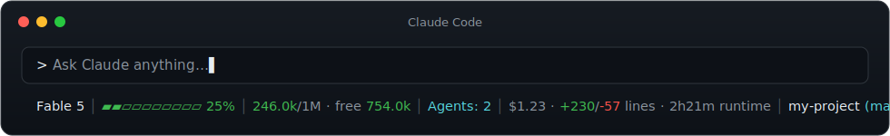

<div align="center">

# claude-code-statusline

**A fast, resume-safe statusline for [Claude Code](https://code.claude.com) — model, context usage, free tokens, running subagents, cost & git branch. Zero required dependencies on Windows.**

[](#installation)
[](#how-the-installer-picks-a-runtime)
[](LICENSE)
[](https://www.npmjs.com/package/@hashox/claude-code-statusline)



</div>

---

## Installation — one command

**Windows** (PowerShell):

```powershell
irm https://raw.githubusercontent.com/HashfoxGmbH/claude-code-statusline/main/install.ps1 | iex
```

**Linux / WSL / macOS**:

```bash
curl -fsSL https://raw.githubusercontent.com/HashfoxGmbH/claude-code-statusline/main/install.sh | bash
```

**npm / npx**:

```bash
npx @hashox/claude-code-statusline
```

Every installer is **idempotent**, merges `~/.claude/settings.json` **losslessly**
(backup written to `settings.json.bak`) and runs a smoke test before finishing.
New Claude Code sessions show the statusline immediately; running sessions after a restart.

## What you see

```text
Fable 5 │ ▰▰▱▱▱▱▱▱▱▱ 25% │ 246.0k/1M · free 754.0k │ Agents: 2 │ $1.23 · +230/-57 lines · 2h21m runtime │ my-project (main)
```

| Segment | Meaning |
|---|---|
| `Fable 5` | Current model |
| `▰▰▱▱▱▱▱▱▱▱ 25%` | Context usage bar — **green** &lt; 70 %, **yellow** ≥ 70 %, **red** ≥ 90 % |
| `246.0k/1M · free 754.0k` | Used / total context and remaining tokens; `Compact bald!` warning at ≥ 85 % |
| `Agents: 2` | Subagents running **right now** (hidden when zero) |
| `$1.23 · +230/-57 lines · 2h21m runtime` | Session cost, lines added/removed, wall-clock runtime |
| `my-project (main)` | Working directory and git branch |

## Why this one?

- **Resume-safe.** The primary data source is the `context_window` field Claude Code
  (≥ 2.1) passes on stdin — live session state, not transcript guesswork. After
  `claude --resume` the numbers are correct immediately.
- **1M-context aware.** The fallback (older Claude Code versions) detects 1M sessions
  through four independent signals (`[1m]` model suffix, `exceeds_200k_tokens`,
  settings model, usage &gt; 200k) — no more bogus `/200k` after resuming a 1M session.
- **Live subagent counter.** Running agents continuously append to
  `<session>/subagents/agent-*.jsonl`; files written within the last 45 s count as active.
- **Never crashes.** Every code path is guarded. Worst case, the statusline shows `Claude`
  — never a stack trace, never a blank line. Hostile/malformed stdin is part of the test suite.
- **Fast.** Reads only the last 512 KB of multi-MB transcripts, reads `.git/HEAD` directly
  instead of spawning `git`, strips the UTF-8 BOM some shells prepend.

## How the installer picks a runtime

| Priority | Windows | Linux / WSL / macOS |
|---|---|---|
| 1 | Node.js (fastest) | python3 |
| 2 | Python | Node.js |
| 3 | **PowerShell — always available, zero extra installs** | — |

All three script variants (`src/statusline.js`, `src/statusline.py`, `src/statusline.ps1`)
are feature-identical, down to the rounding behavior.

## Why not a Claude Code plugin?

Plugins cannot register a statusline — `statusLine` is not a plugin-manifest field and can
only be configured in `settings.json`
([official docs](https://code.claude.com/docs/en/statusline)). That's why this project ships
as an installer that merges your settings safely instead.

## Uninstall

Remove the `statusLine` key from `~/.claude/settings.json` (or restore `settings.json.bak`)
and delete `~/.claude/statusline.{js,py,ps1}`.

## Development

```text
src/statusline.js    Node variant
src/statusline.py    Python variant
src/statusline.ps1   PowerShell variant (Windows zero-dependency fallback)
build.ps1            regenerates the self-contained install.ps1 / install.sh from src/
bin/install.js       npx installer
```

Edit **only** the files in `src/`, then run `build.ps1` so the embedded copies inside the
installers stay in sync. Keep all three variants behaviorally identical.

## License

[MIT](LICENSE)
