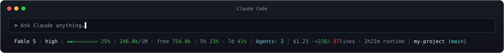

<div align="center">

# claude-code-statusline

**A fast, resume-safe statusline for [Claude Code](https://code.claude.com) — see context, rate limits and thinking mode at a glance. Zero dependencies on Windows.**

[](#installation)
[](#how-the-installer-picks-a-runtime)
[](LICENSE)
[](https://www.npmjs.com/package/@hashfox/claude-code-statusline)



</div>

---

<a id="installation"></a>

## Installation — one command

**Windows** (PowerShell):

```powershell
irm https://raw.githubusercontent.com/HashfoxGmbH/claude-code-statusline/main/install.ps1 | iex
```

**Linux / WSL / macOS**:

```bash
curl -fsSL https://raw.githubusercontent.com/HashfoxGmbH/claude-code-statusline/main/install.sh | bash
```

**npm / npx**:

```bash
npx @hashfox/claude-code-statusline
```

Every installer is **idempotent**, merges `~/.claude/settings.json` **losslessly**
and runs a smoke test before finishing. Your settings from before the first install are
saved as `settings.json.bak` — re-running an installer never overwrites that backup.
Installers check that a runtime actually works before using it (e.g. the Microsoft Store
`python.exe` placeholder on Windows is skipped).
New Claude Code sessions show the statusline immediately; running sessions after a restart.

**Update:** run the same command again. It replaces the script and keeps your original
`settings.json.bak`.

<details>
<summary><b>Prefer to read the installer before running it?</b></summary>

```powershell
# Windows
irm https://raw.githubusercontent.com/HashfoxGmbH/claude-code-statusline/main/install.ps1 -OutFile install.ps1
notepad install.ps1
powershell -ExecutionPolicy Bypass -File install.ps1
```

```bash
# Linux / WSL / macOS
curl -fsSL https://raw.githubusercontent.com/HashfoxGmbH/claude-code-statusline/main/install.sh -o install.sh
less install.sh
bash install.sh
```

</details>

<details>
<summary><b>Manual installation (no installer)</b></summary>

Copy one script from [`src/`](src) to `~/.claude/` and add a `statusLine` entry to
`~/.claude/settings.json`:

```bash
mkdir -p ~/.claude
curl -fsSL https://raw.githubusercontent.com/HashfoxGmbH/claude-code-statusline/main/src/statusline.py -o ~/.claude/statusline.py
```

```json
{
  "statusLine": {
    "type": "command",
    "command": "python3 \"$HOME/.claude/statusline.py\"",
    "padding": 0
  }
}
```

On Windows use `statusline.js` with `"command": "node \"C:/Users/<you>/.claude/statusline.js\""`
(forward slashes work in both Git Bash and PowerShell), or `statusline.ps1` with
`"command": "powershell -NoProfile -ExecutionPolicy Bypass -File \"C:/Users/<you>/.claude/statusline.ps1\""`.

</details>

## Requirements

- **Claude Code 2.1 or later.** Older versions work too, using a transcript-based fallback
  for the context numbers.
- **One runtime:** Node.js ≥ 12, Python ≥ 3.6 — or, on Windows, nothing at all
  (PowerShell 5.1, built into every Windows, is enough).
- A terminal font that has the characters `▰ ▱ │ ·` (any modern terminal does; see
  [Troubleshooting](#troubleshooting)).

Newer segments show up as soon as Claude Code sends the data and stay hidden otherwise:
thinking mode needs a Claude Code version that reports `effort` / `thinking` / `fast_mode`,
and rate limits appear only for claude.ai **Pro and Max** plans (or behind a gateway spend limit).

## What you see

```text
Fable 5 · high │ ▰▰▱▱▱▱▱▱▱▱ 25% │ 246.0k/1M · free 754.0k │ 5h 23% · 7d 41% │ Agents: 2 │ $1.23 · +230/-57 lines · 2h21m runtime │ my-project (main)
```

| Segment | Meaning |
|---|---|
| `Fable 5` | Current model |
| `· high` | Reasoning effort (`low` / `medium` / `high` / `xhigh` / `max`) — updates live on `/effort`; hidden when the model has no effort parameter |
| `· thinking off` | Shown only when extended thinking is disabled |
| `⚡` | Fast mode is on (hidden otherwise) |
| `▰▰▱▱▱▱▱▱▱▱ 25%` | Context usage bar — **green** &lt; 70 %, **yellow** ≥ 70 %, **red** ≥ 90 % |
| `246.0k/1M · free 754.0k` | Used / total context and remaining tokens; `compact soon` warning at ≥ 85 % |
| `5h 23% · 7d 41%` | Rate limits: 5-hour and 7-day window (claude.ai Pro/Max), plus `spend` behind a gateway spend limit. Same colors as the context bar; from 70 % on with the time until reset, e.g. `5h 92% (1h12m)`. Hidden when Claude Code sends no rate limits |
| `Agents: 2` | Subagents running **right now**, including ones waiting on a long tool call (hidden when zero) |
| `$1.23 · +230/-57 lines · 2h21m runtime` | Session cost, lines added/removed, wall-clock runtime |
| `my-project (main)` | Working directory and git branch |

Segments you don't need are simply not shown — no subagents, no cost yet, no git repo or no
rate limits means a shorter line. A few more examples:

```text
Fable 5 · max ⚡ │ ▰▰▰▰▰▰▰▰▰▱ 88% │ 176.0k/200k · free 24.0k compact soon │ 5h 92% (1h12m) · 7d 41%
Haiku 4.5 · thinking off │ ▰▰▱▱▱▱▱▱▱▱ 15% │ 30.0k/200k · free 170.0k
```

The first line is a session near its limits: max effort with fast mode, a nearly full context
(yellow bar from 70 %, red from 90 %, `compact soon` from 85 %) and a 5-hour limit that resets in 1h12m.

## Why this one?

- **Resume-safe.** The primary data source is the `context_window` field Claude Code
  (≥ 2.1) passes on stdin — live session state, not transcript guesswork. After
  `claude --resume` the numbers are correct immediately.
- **1M-context aware.** The fallback (older Claude Code versions) detects 1M sessions
  through four independent signals (`[1m]` model suffix, `exceeds_200k_tokens`,
  settings model, usage &gt; 200k) — no more bogus `/200k` after resuming a 1M session.
- **Thinking mode at a glance.** Effort level, extended thinking and fast mode come straight
  from the live session fields `effort.level`, `thinking.enabled` and `fast_mode`. Older Claude
  Code versions without these fields simply show the model name as before.
- **Live subagent counter.** Running agents continuously append to
  `<session>/subagents/agent-*.jsonl`; files written within the last 45 s count as active.
  An agent that is waiting on a long tool call (e.g. a 5-minute build) writes nothing in the
  meantime — it still counts for up to 10 minutes (the maximum Bash timeout) as long as its
  transcript ends in a pending tool call or tool result.
- **Rate limits.** The 5-hour and 7-day usage of your claude.ai plan (and a gateway spend
  limit, if any) come from the live `rate_limits` field, with a reset countdown once they
  get tight.
- **Never crashes.** Every code path is guarded. Worst case, the statusline shows `Claude`
  — never a stack trace, never a blank line, even on malformed or hostile stdin.
- **Fast.** Reads only the last 512 KB of multi-MB transcripts, reads `.git/HEAD` directly
  instead of spawning `git`, strips the UTF-8 BOM some shells prepend.
- **Local and read-only.** No network access, no telemetry, never writes a file. It reads only
  what Claude Code pipes in, the end of the session transcript and subagent transcripts,
  `.git/HEAD`, and — as a fallback for 1M detection — `~/.claude/settings.json`.

## How the installer picks a runtime

| Priority | Windows | Linux / WSL / macOS |
|---|---|---|
| 1 | Node.js (fastest) | python3 |
| 2 | Python | Node.js |
| 3 | **PowerShell — always available, zero extra installs** | — |

All three script variants (`src/statusline.js`, `src/statusline.py`, `src/statusline.ps1`)
are feature-identical, down to the rounding behavior.

## Troubleshooting

**The statusline doesn't appear.** It only shows in sessions started after the install —
restart Claude Code. Then check that `~/.claude/settings.json` contains a `statusLine` entry
pointing to `~/.claude/statusline.*`.

**Test it by hand.** This should print a line starting with `Test │`:

```bash
# Linux / WSL / macOS (use node ~/.claude/statusline.js if you installed the Node variant)
echo '{"model":{"display_name":"Test"}}' | python3 ~/.claude/statusline.py
```

```powershell
# Windows (use python or powershell -File with statusline.py / .ps1 if that's what you have)
[Console]::OutputEncoding = [Text.Encoding]::UTF8
'{"model":{"display_name":"Test"}}' | node "$env:USERPROFILE\.claude\statusline.js"
```

**Boxes or `?` instead of `▰ ▱ │`.** Your terminal font lacks these characters. Use a
modern terminal (Windows Terminal, iTerm2, most Linux terminals) or switch to a font with
broader Unicode coverage.

**Garbled characters like `Ôöé` in a PowerShell test.** PowerShell decodes program output
with the console's legacy code page. Run `[Console]::OutputEncoding = [Text.Encoding]::UTF8`
first, as above. Claude Code itself reads UTF-8, so the real statusline is not affected.

**`Agents: N` doesn't go down right away.** A finished subagent drops out after 45 s. One whose
transcript ends in a pending tool call counts for up to 10 minutes — for example if it was
interrupted in the middle of a tool call.

## Why not a Claude Code plugin?

Plugins cannot register a statusline — `statusLine` is not a plugin-manifest field and can
only be configured in `settings.json`
([official docs](https://code.claude.com/docs/en/statusline)). That's why this project ships
as an installer that merges your settings safely instead.

## Uninstall

Use the same way you installed:

```powershell
# Windows
& ([scriptblock]::Create((irm https://raw.githubusercontent.com/HashfoxGmbH/claude-code-statusline/main/install.ps1))) -Uninstall
```

```bash
# Linux / WSL / macOS
curl -fsSL https://raw.githubusercontent.com/HashfoxGmbH/claude-code-statusline/main/install.sh | bash -s -- --uninstall

# npm
npx @hashfox/claude-code-statusline --uninstall
```

Uninstalling removes the `statusLine` entry — or restores the statusline you had before, if
`settings.json.bak` contains one — and deletes `~/.claude/statusline.{js,py,ps1}`. All other
settings stay as they are. It only touches `settings.json` if this statusline is the one
registered there.

## Development

```text
src/statusline.js    Node variant
src/statusline.py    Python variant
src/statusline.ps1   PowerShell variant (Windows zero-dependency fallback)
build.ps1            regenerates the self-contained install.ps1 / install.sh from src/
                     (pwsh ./build.ps1 - works on Windows, macOS and Linux)
bin/install.js       npx installer
```

Edit **only** the files in `src/`, then run `build.ps1` so the embedded copies inside the
installers stay in sync. Keep all three variants behaviorally identical.

## License

[MIT](LICENSE)
